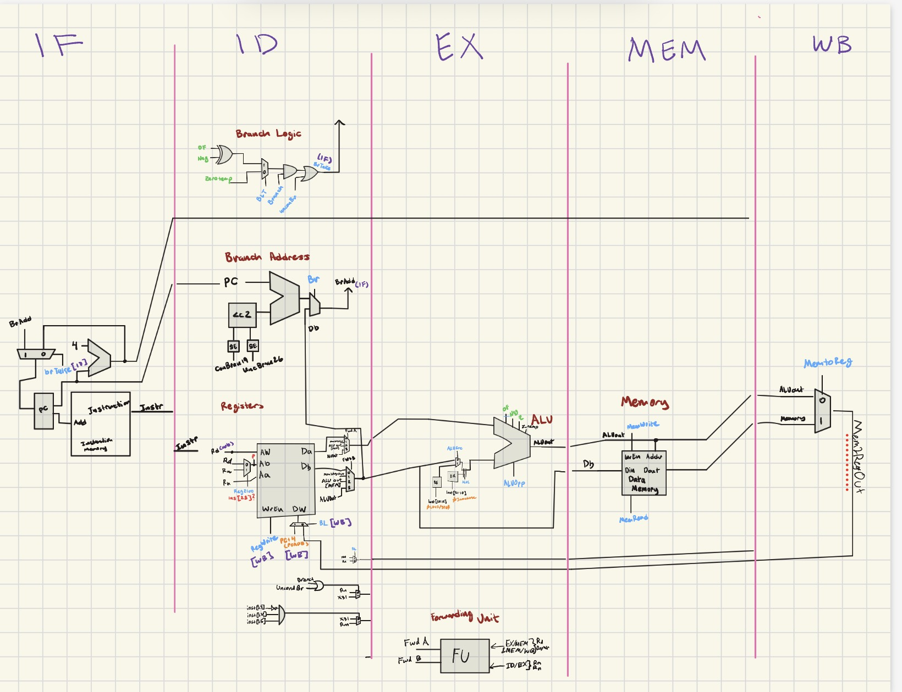

# ARM-Inspired Pipelined CPU

A SystemVerilog implementation of a 64-bit, ARM-inspired pipelined processor developed as a computer architecture project.

The design models a five-stage processor pipeline and includes an instruction decoder, register file, ALU, data memory, branch control, pipeline registers, and forwarding logic. The project was developed and tested primarily through RTL simulation with ModelSim.

> This repository documents a course project completed in June. It is an educational CPU design and is not presented as a production ARM-compatible processor or as a completed DE1-SoC FPGA implementation.

## Project summary

The processor was designed around a subset of an ARM/LEGv8-style instruction set. It supports arithmetic and logical operations, immediate operations, loads and stores, unconditional and conditional branches, branch-with-link, and register-indirect branching.

The implementation focuses on understanding how instructions move through a pipeline and how a processor handles dependencies between nearby instructions. Rather than treating the CPU as one large behavioral block, the design is decomposed into reusable structural modules and pipeline-stage registers.

## Main features

- 64-bit datapath
- 32 general-purpose registers with a protected zero register
- 32-bit instruction words
- Five conceptual pipeline stages:
  - Instruction Fetch (IF)
  - Instruction Decode (ID)
  - Execute (EX)
  - Memory Access (MEM)
  - Write Back (WB)
- Arithmetic and logic operations implemented from smaller digital components
- Immediate sign extension and zero extension
- Branch target calculation and branch decision logic
- Load/store data memory model
- Register forwarding from later pipeline stages
- Pipeline registers between processing stages
- ModelSim testbenches and waveform configuration files
- Benchmark-driven instruction memory using `$readmemb`

## Pipeline overview

```text
        +----+     +----+     +----+     +-----+     +----+
PC ---> | IF | --> | ID | --> | EX | --> | MEM | --> | WB |
        +----+     +----+     +----+     +-----+     +----+
          ^          |          ^           |          |
          |          |          |           |          |
          +----------+----------+-----------+----------+
                    forwarding / write-back paths
```



### Instruction Fetch

The program counter selects an instruction from instruction memory. The normal next address is calculated by adding four to the current program counter. Branch logic can replace that address with a conditional, unconditional, or register-based target.

### Instruction Decode

The control unit examines the instruction opcode and generates control signals for the ALU, register file, memory, write-back selection, and branch behavior. The register file provides two source operands.

### Execute

The ALU performs arithmetic and logical operations. Immediate operands are selected through sign-extension or zero-extension units. Branch addresses and branch conditions are also evaluated as part of the control flow logic.

### Memory Access

Load and store instructions access a byte-addressed data memory model. The memory model checks alignment, transfer size, and bounds during simulation.

### Write Back

The result selected from the ALU, memory, or link-address path is written back to the register file on the appropriate clock edge.

## Hazard handling and forwarding

A pipelined processor can encounter a data hazard when an instruction needs a value that a previous instruction has not yet written back. This project includes forwarding logic that compares source register identifiers against destination registers in later pipeline stages.

The forwarding unit produces selection signals for the ALU inputs. These signals select among:

- the value read directly from the register file;
- an ALU result from a later stage; and
- a value being returned through the memory/write-back path.

The design also treats the architectural zero register specially so that it does not create a false forwarding dependency.

## Instruction support

The control logic includes support for the course project's ARM-inspired instruction subset, including:

- `ADDI: Add immediate`
- `ADDS: Add & set flags`
- `SUBS: Subtract & set flags`
- `LDUR: Load byte unscaled offset`
- `STUR: Store register unscaled offset`
- `B: Branch`
- `CBZ: Conditional branch if zero`
- `BLT: Branch if less than`
- `BL: Branch with link`
- `BR: Branch to register`

The exact encodings and control outputs are defined in `control.sv`.

## Repository contents

### Processor RTL

| File or group | Purpose |
|---|---|
| `pipelinedCPU.sv` | Top-level pipelined processor and integrated testbench |
| `cpu.sv` | Earlier/non-pipelined processor organization used during development |
| `IF_ID.sv` | IF-to-ID pipeline register |
| `ID_EX.sv` | ID-to-EX pipeline register |
| `EX_MEM.sv` | EX-to-MEM pipeline register |
| `MEM_WB.sv` | MEM-to-WB pipeline register |
| `alu.sv` | 64-bit ALU and status flags |
| `control.sv` | Opcode decoder and control-signal generation |
| `regfile.sv` | Register file with two read paths and one write path |
| `instructmem.sv` | Instruction memory model and benchmark loader |
| `datamem.sv` | Byte-addressed data memory model |
| `FWRD_UNIT.sv` | Forwarding selection logic used by the pipelined CPU |
| `ForwardingConditionals.sv` | Register-match and hazard-detection logic |
| `branchLogic.sv` | Conditional and unconditional branch decision logic |
| `RnAndRmOutMUX.sv` | Source-register selection logic for instruction formats |

### Combinational building blocks

The repository also contains reusable structural modules for:

- one-bit, four-bit, and 64-bit adders;
- two-, four-, eight-, and 32-input multiplexers;
- 64-bit versions of those multiplexers;
- bitwise AND, OR, XOR, and NOT operations;
- sign extension and zero extension;
- a left-shift-by-two unit;
- zero detection; and
- enabled positive- and negative-edge flip-flops.

### Simulation files

Files ending in `.do` are ModelSim waveform or compile/run scripts. They add useful signals to the waveform viewer or compile the design and launch the main simulation.

The benchmark selected by `instructmem.sv` is loaded with `$readmemb`. Update the benchmark macro before running a different instruction test program.

## Verification approach

Individual modules include focused testbenches that exercise representative input patterns. Examples include:

- all input combinations for small muxes and one-bit adders;
- arithmetic, logical, carry, zero, negative, and overflow cases for the ALU;
- register writes, reads, enable behavior, reset behavior, and the protected zero register;
- aligned data-memory reads and writes across multiple transfer sizes;
- sign and zero extension patterns;
- pipeline register transfer across clock edges; and
- forwarding and hazard combinations for EX/MEM and MEM/WB dependencies.

The integrated CPU testbench drives reset and clock activity while the waveform configuration makes internal pipeline behavior visible.

## What this project demonstrates

- RTL design in SystemVerilog
- structural digital logic and module composition
- processor datapath and control-path design
- five-stage pipelining
- data hazards and operand forwarding
- instruction decoding
- synchronous state elements
- memory modeling and alignment checks
- simulation-based verification
- debugging through waveforms

## Project context and contribution

This was a class project completed collaboratively. The repository is intended to present the technical work and learning outcomes accurately. The implementation represents work completed for the course and should not be interpreted as an official ARM implementation or as a claim of ISA compatibility beyond the project's defined instruction subset.

## Limitations and possible improvements

- Add a dedicated hazard-stall/flush unit for hazards that cannot be resolved by forwarding alone.
- Replace structural gate-delay modeling with a cleaner synthesizable RTL variant for FPGA implementation.
- Add automated assertions and a self-checking integration testbench.
- Add a documented instruction encoding table and sample benchmark programs.
- Clean up and consolidate historical duplicate modules and compile entries.
- Add a reproducible simulator Makefile or script for a current open-source simulator.
- Add synthesis constraints only if the design is later targeted to actual hardware.

## License

MIT License. See [`LICENSE`](LICENSE).
